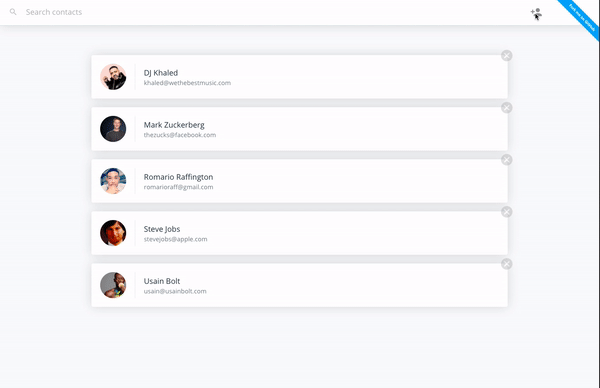

# Contact List 🗒 ⚛️ | [Demo](#) 

[](https://travis-ci.org/romarioraffington/react-contact-list) [](https://david-dm.org/romarioraffington/react-contact-list.svg) [](https://david-dm.org/expressjs/express?type=dev)

Contact List is a React application that allows users to easily create, edit and remove contacts in real time.

[](#)

## Getting Started
```shell
git clone https://github.com/romarioraffington/react-contact-list.git
yarn install
yarn start
```
 The application is expecting to connect to an API. You can clone the [Bakend API Repo](#) to get up and running quickly.

## Running Tests
```shell
yarn test
```

## Running Coverage
```shell
yarn coverage
```

## Building the Project
```shell
yarn build
```

## Contributing
Feel free to submit a pull requests! For specifics on how to contribute to this project, check out the  [contributing file](CONTRIBUTING.md).

## License
Contacts is released under the [MIT License](LICENSE).

